# 人人都能玩云服务器

本手册是给想玩云服务器，并且不熟悉 linux 系统的小白准备的。对于熟悉 linux 系统者，玩云服务器已经是小 case。所以本手册介绍的云服务器，也是 Windows 系统的云服务器，让学习者了解到云服务器其实一点也不神秘，有了这个基础，待熟悉 linux 系统后，转其他系统的云服务器也水到渠成了。

## 什么是服务器

服务器其实也是计算机，它在网络中是为其他客户机（例如手机，笔记本，以及火车系统等大型设备）提供计算或应用服务，它的内部结构与普通计算机相差不大，都是 CPU，硬盘，内存，系统等组成。

## 云服务器选购

国内大的云服务器提供商有阿里云，腾讯云，华为云，百度云。便宜的云服务器，活动价或新人价一般都是几十块一年。例如腾讯云的双十一是这样的：


服务器有按宽带计费和流量计费两种，按流量计费的 `轻量应用服务器` 更便宜，更适合个人把玩。

查看各家服务器购买页，看看活动价，各服务器配置，以及优惠力度，选择一款适合自己的买下来。配置的时候，区域选择离自己所在地近的，镜像（也就是系统）选 Windows 系统（购买后还可以重置任意系统），其他通常是默认勾选。

腾讯轻量应用服务器购买页是这样的：

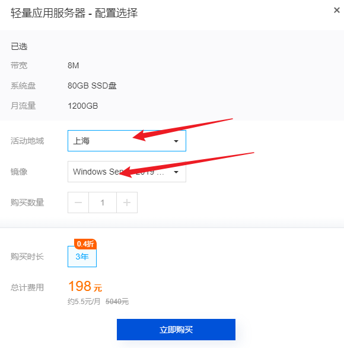

## 云服务器登录

服务器购买后，开始配置和登录。

下面以按宽带计费腾讯云服务器为例。

**重置密码**：使用购买云服务器的账号登录腾讯云控制台（https://console.cloud.tencent.com/ ），`云产品` 里找到并点击 `云服务器`，就看到了你购买的服务器 `实例`，勾选服务器，就可以点击 `重置密码`：

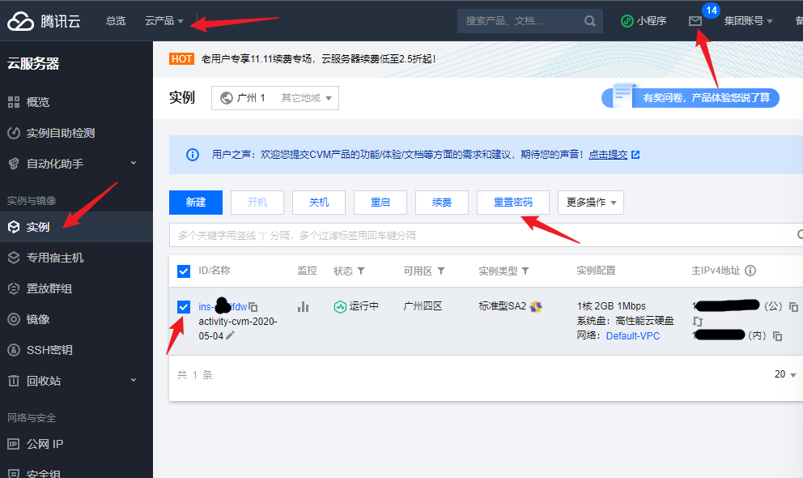

初始密码在系统消息中查看（某些配置的服务器没有初始密码，重置密码时直接输入新密码就可），按提示重置密码即可。

**重装系统**：实例页后面点击 `更多`，点击 `重装系统`：

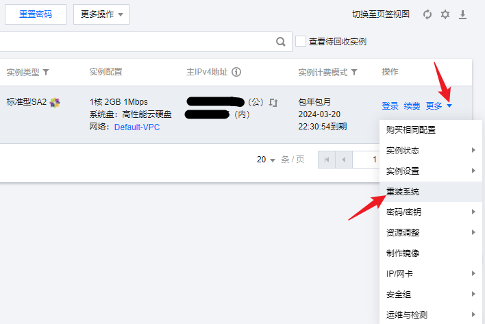

进入 `重装配置` 页后，选择镜像，输入新密码，下一步确认重装，等待装完即可：

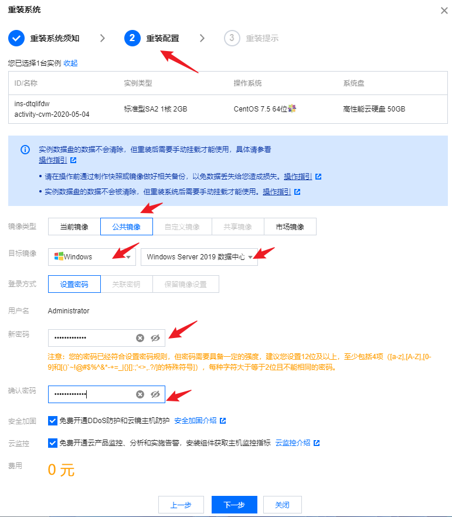

**登录服务器**：

- 标准登录：实例页后面点击 `登录`，输入密码，登录即可进入服务器桌面。

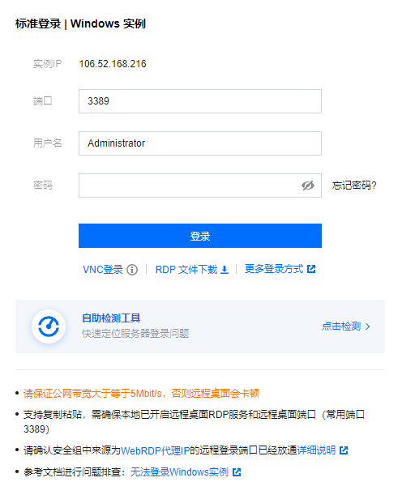


- 远程桌面登录：实例页复制公网 IP，


快捷键 `Win + S` 打开运行，输入 `mstsc`，点确定，

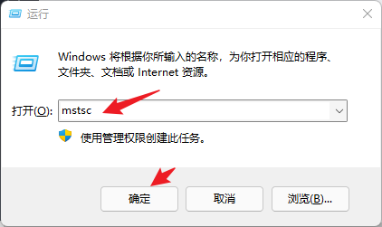

展开 `显示选项`，粘贴复制的公网 IP，输入用户名（默认 `Administrator`），

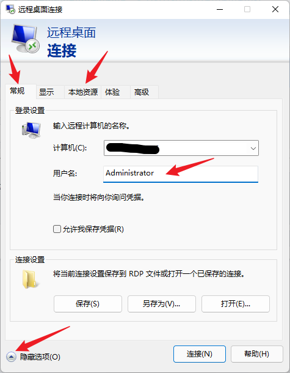

转到 `本地资源`，点击 `详细信息`，展开 `驱动器`，选择一个共享盘（用于本地和服务器互传文件），点 `确定`，点 `连接`，

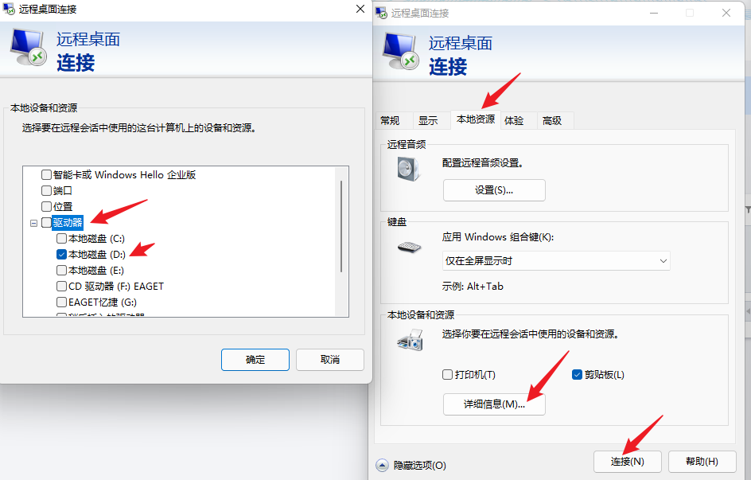

弹出的窗口输入服务器登录密码，

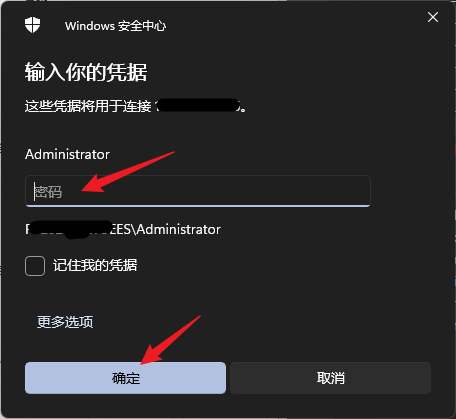

一路确认登录后，即可进入服务器桌面：


## 云服务器简单使用

登录云服务器后，就可以像使用本地的 Windows 系统计算机一样使用服务器了。

你可以打开浏览器，搜索，下载安装各种软件等：

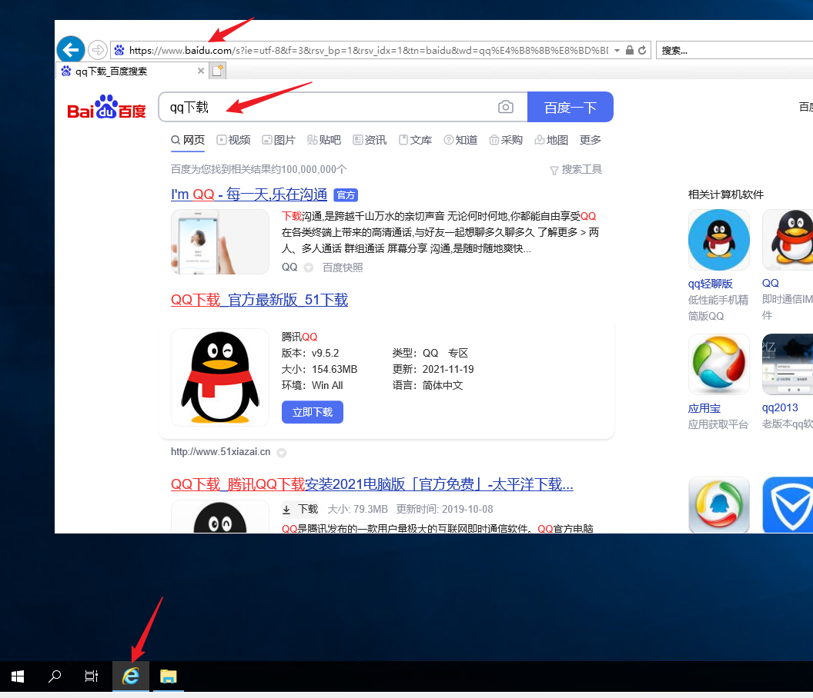

你也可以打开资源管理器，正常使用硬盘，以及本地共享的盘：

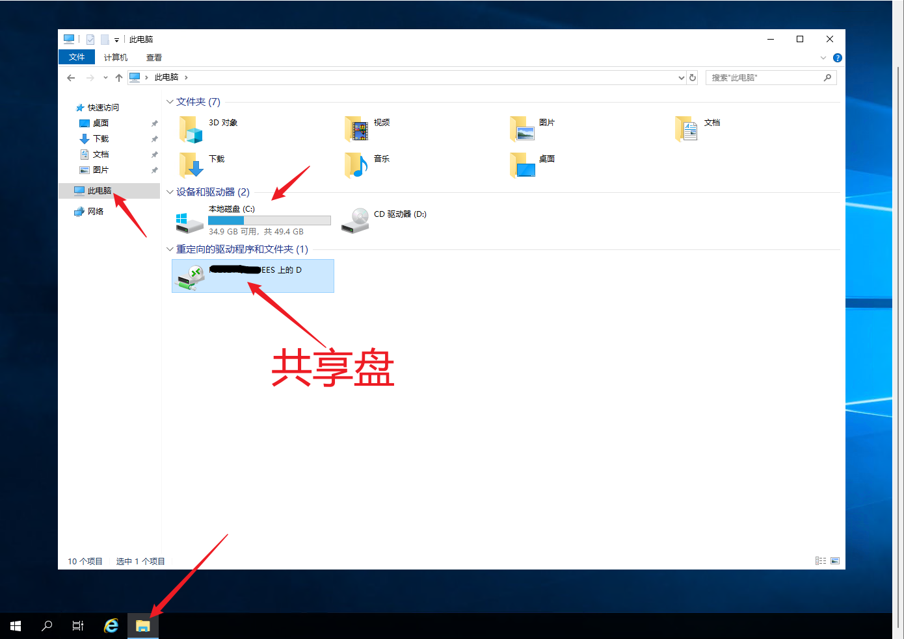

共享盘里的文件，本地和远程都可以使用，因此可以将文件放到里面，就实现远程本地文件互传。

下面用一个简单的例子，展示一下在服务器上部署应用，让任何人都能访问到你展示的内容（或提供的服务）：

## 云服务器极简建站示例

下面是以 `远程桌面登录` 进行的演示。

- 安装启动 Nginx

服务器端，浏览器打开官网下载 Nginx（也可以本地下载完，放到共享盘）：http://nginx.org/en/download.html

下载完解压到 C 盘中：

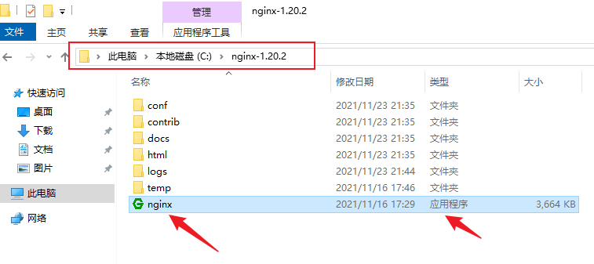

双击 `nginx` 应用程序启动 Nginx，打开浏览器访问 http://localhost/ ，你将看到 Nginx 欢迎页：

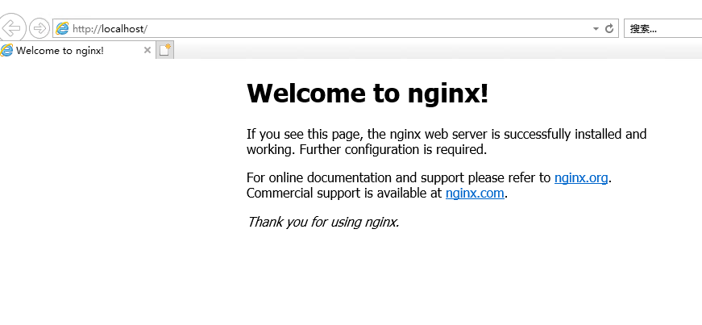

- 将本地站点文件夹传到服务器

访问 [零基础 GitHub 免费搭建博客](https://github.com/smallwhite0001/GitHub-build-personal-blog)，只需要完成本地建站的部分，执行 `hexo g` 命令生成静态网页后，将 `blog` 文件夹下的 `public` 文件夹复制到共享盘（如果就在共享盘中，就不用复制了），然后服务器端打开共享盘，将这个 `public` 文件夹再次复制到服务器的 C 盘中：

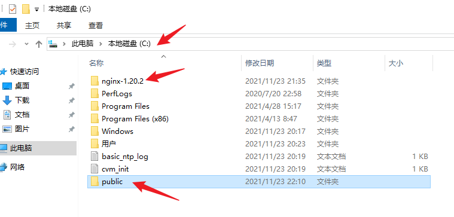

- 配置并访问站点

服务器端，以记事本打开 `C:\nginx-1.20.2\conf` 文件夹下的 `nginx.conf` 文件，

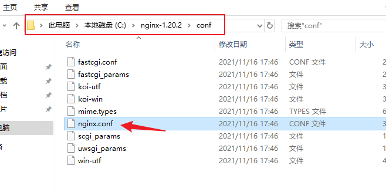

找到如下内容：

```
    server {
        listen       80;
        server_name  localhost;

        #charset koi8-r;

        #access_log  logs/host.access.log  main;

        location / {
            root   html;
            index  index.html index.htm;
        }
```

将 `server_name` 后面的 `localhost` 改为公网 IP，`root` 后面的 `html` 改为上面 `public` 文件夹路径：

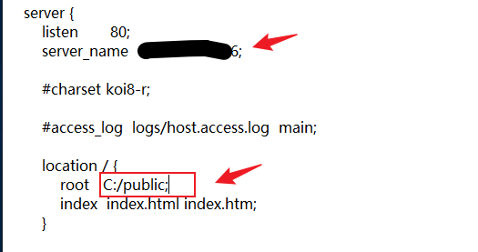

打开 `命令提示符`，`cd` 命令进入 nginx 文件夹，输入命令 `nginx -s reload` 重载 Nginx 配置，

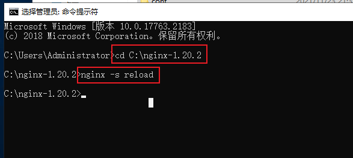

就可以打开浏览器，使用公网 IP 访问你的网站啦：


当然不能让所有人都使用你的公网 IP 访问你的网站，所以你需要购买域名，然后解析域名，以及域名和网站备案等，完成后，将上面 `nginx.conf` 文件中的公网 IP 改为你的域名，就可以任何人都使用你的域名访问你的网站了，例如 baidu.com 。

更多精彩世界，留给您自己去探索吧。